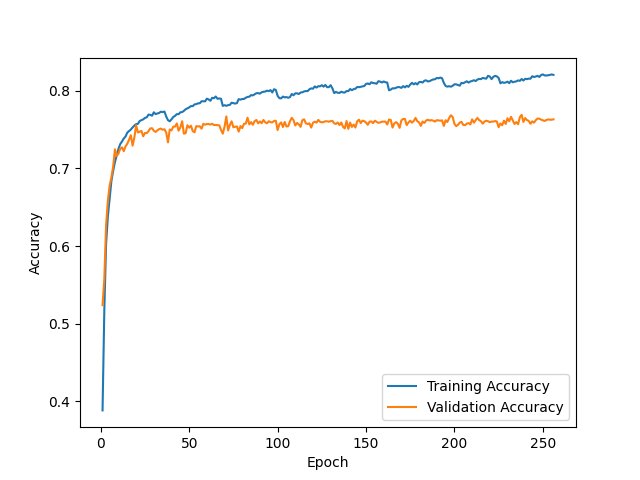

F1 score for random initialization #1 = 0.741

Prediction matrix for initialization #1

|   | N   | O   | A   |
|---|-----|-----|-----|
| N | 463 | 39  | 2   |
| O | 80  | 160 | 15  |
| A | 1   | 20  | 38  |

---

F1 score for random initialization #2 = 0.785

Prediction matrix for initialization #2

|   | N   | O   | A   |
|---|-----|-----|-----|
| N | 465 | 36  | 3   |
| O | 75  | 173 | 7   |
| A | 2   | 16  | 41  |

---

F1 score for random initialization #3 = 0.765

Prediction matrix for initialization #3

|   | N   | O   | A   |
|---|-----|-----|-----|
| N | 467 | 35  | 2   |
| O | 74  | 169 | 7   |
| A | 2   | 18  | 39  |

---

F1 score for ensemble of 3 NNs + logreg on 9 values = 0.757

Prediction matrix for ensemble
|   | N   | O   | A   |
|---|-----|-----|-----|
| N | 456 | 44  | 4   |
| O | 80  | 164 | 11  |
| A | 2   | 16  | 41  |

---

