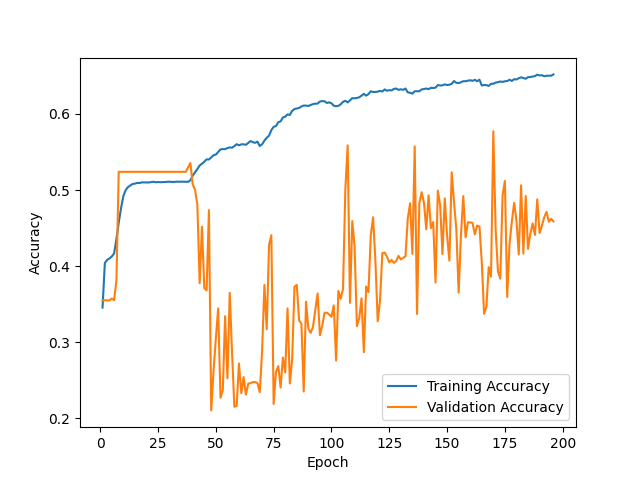
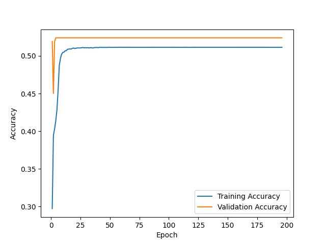
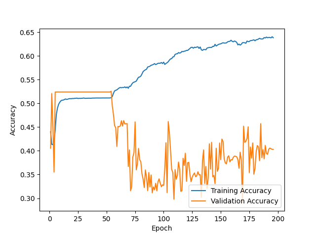
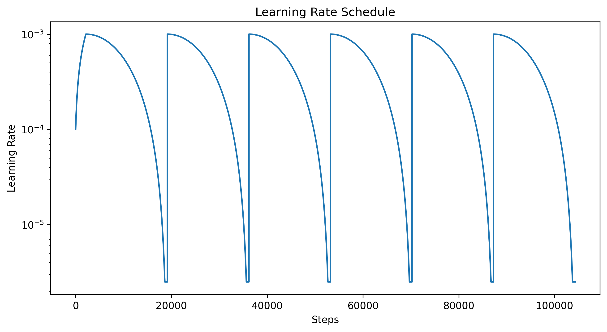

F1 score for random initialization #1 = 0.543

Prediction matrix for initialization #1

|   | N   | O   | A   |
|---|-----|-----|-----|
| N | 430 | 53  | 21  |
| O | 124 | 105 | 26  |
| A | 21  | 16  | 22  |

---

F1 score for random initialization #2 = nan

Prediction matrix for initialization #2

|   | N   | O   | A   |
|---|-----|-----|-----|
| N | 499 | 4   | 1   |
| O | 254 | 1   | 0   |
| A | 59  | 0   | 0   |

---

F1 score for random initialization #3 = nan

Prediction matrix for initialization #3

|   | N   | O   | A   |
|---|-----|-----|-----|
| N | 504 | 0   | 0   |
| O | 255 | 0   | 0   |
| A | 59  | 0   | 0   |

---

F1 score for ensemble of 3 NNs + logreg on 9 values = 0.539

Prediction matrix for ensemble

|   | N   | O   | A   |
|---|-----|-----|-----|
| N | 463 | 40  | 1   |
| O | 69  | 178 | 8   |
| A | 2   | 18  | 39  |

---

