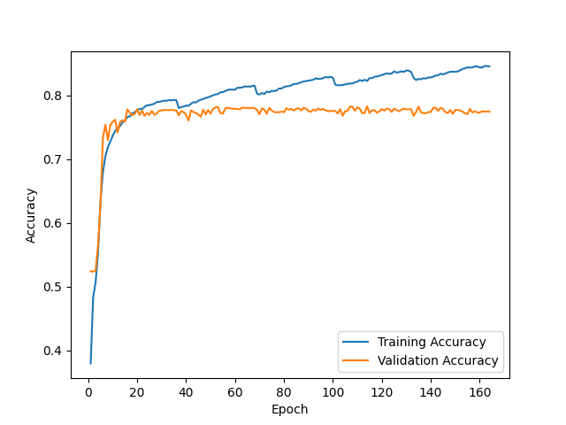
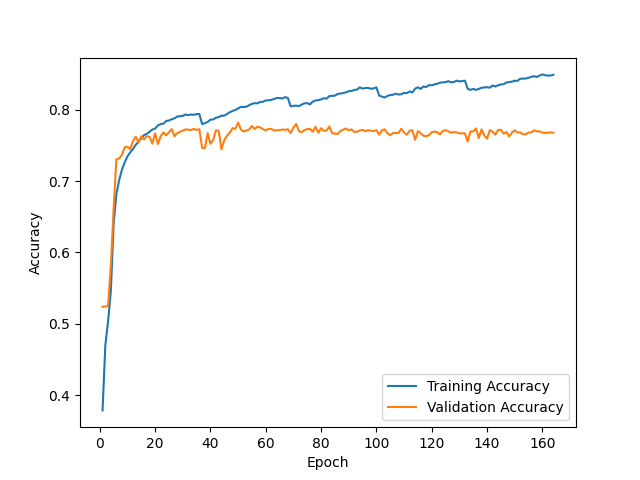
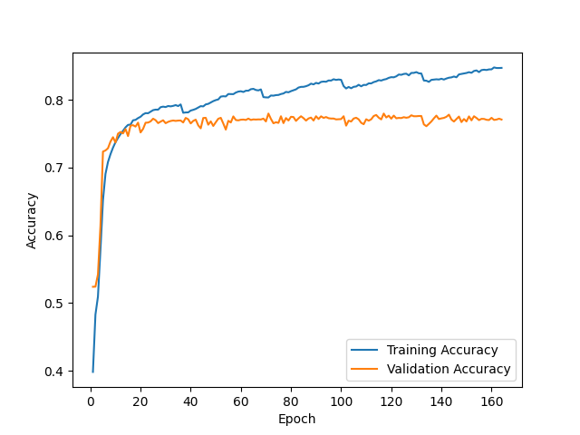

F1 score for random initialization #1 = 0.807

Prediction matrix for initialization #1

|   | N   | O   | A   |
|---|-----|-----|-----|
| N | 464 | 39  | 1   |
| O | 70  | 177 | 8   |
| A | 3   | 11  | 45  |

---

F1 score for random initialization #2 = 0.776

Prediction matrix for initialization #2

|   | N   | O   | A   |
|---|-----|-----|-----|
| N | 469 | 34  | 1   |
| O | 74  | 170 | 11  |
| A | 4   | 15  | 40  |

---

F1 score for random initialization #3 = 0.791

Prediction matrix for initialization #3

|   | N   | O   | A   |
|---|-----|-----|-----|
| N | 466 | 37  | 1   |
| O | 67  | 176 | 12  |
| A | 2   | 14  | 43  |

---

F1 score for ensemble of 3 NNs + logreg on 9 values = 0.796

Prediction matrix for ensemble

|   | N   | O   | A   |
|---|-----|-----|-----|
| N | 463 | 39  | 2   |
| O | 70  | 177 | 8   |
| A | 2   | 14  | 43  |

---

