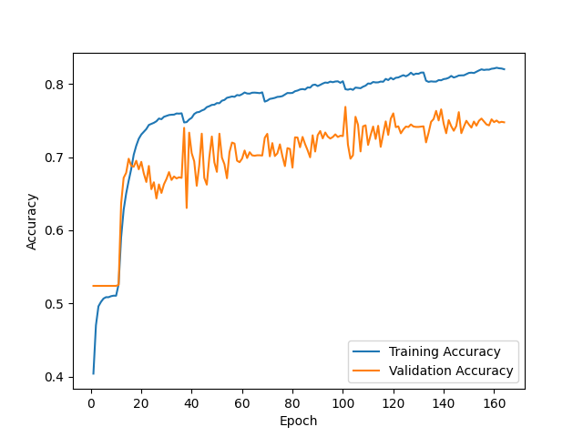
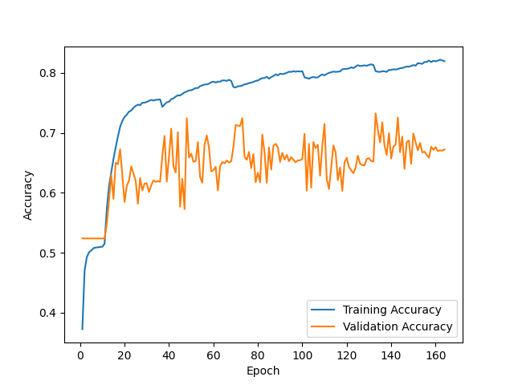
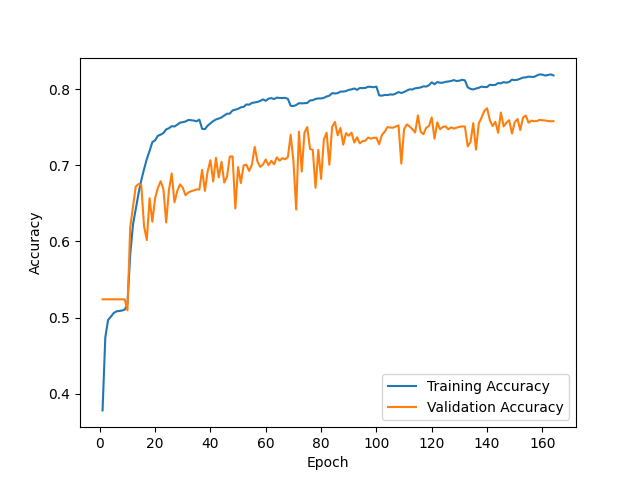
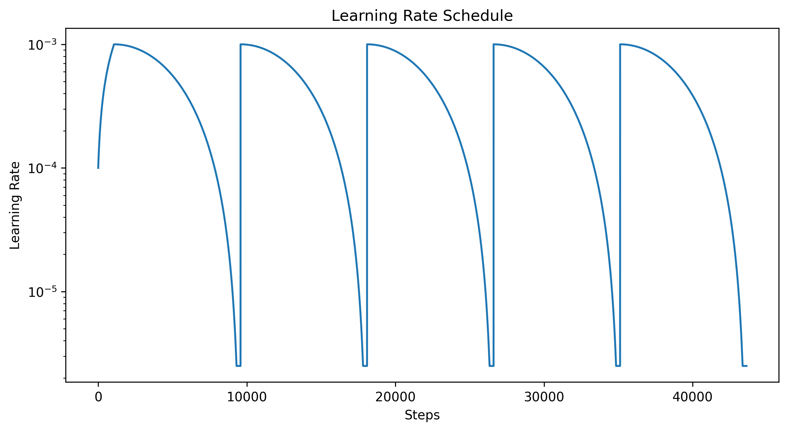

F1 score for random initialization #1 = 0.757

Prediction matrix for initialization #1

|   | N   | O   | A   |
|---|-----|-----|-----|
| N | 461 | 38  | 5   |
| O | 74  | 162 | 19  |
| A | 3   | 12  | 44  |

---

F1 score for random initialization #2 = 0.764

Prediction matrix for initialization #2

|   | N   | O   | A   |
|---|-----|-----|-----|
| N | 455 | 46  | 3   |
| O | 67  | 168 | 20  |
| A | 2   | 12  | 45  |

---

F1 score for random initialization #3 = 0.793

Prediction matrix for initialization #3

|   | N   | O   | A   |
|---|-----|-----|-----|
| N | 471 | 29  | 4   |
| O | 70  | 172 | 13  |
| A | 3   | 11  | 45  |

---

F1 score for ensemble of 3 NNs + logreg on 9 values = 0.794

Prediction matrix for ensemble

|   | N   | O   | A   |
|---|-----|-----|-----|
| N | 464 | 39  | 4   |
| O | 65  | 179 | 11  |
| A | 2   | 13  | 44  |

---

