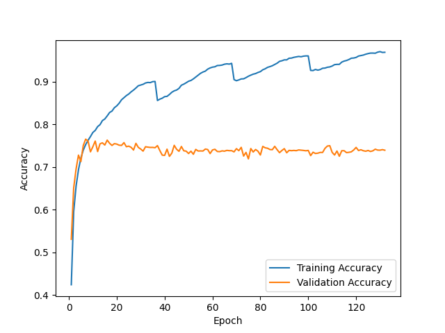
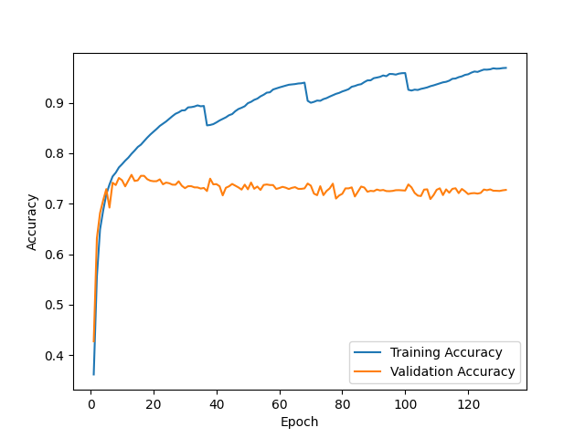
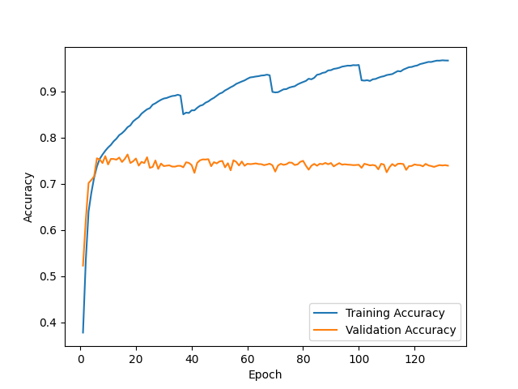
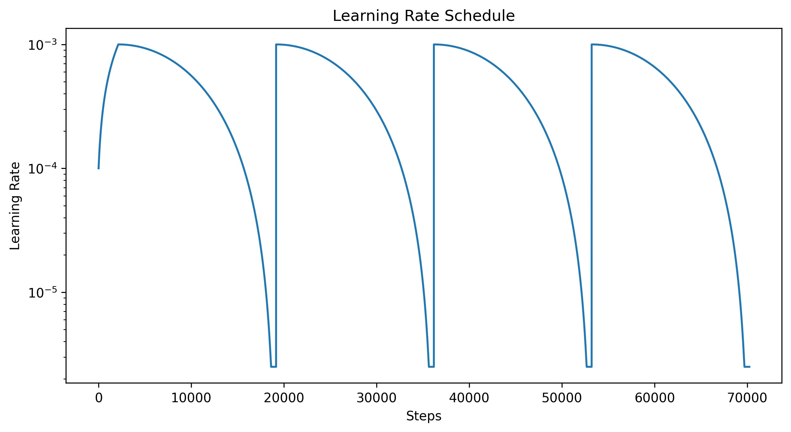

F1 score for random initialization #1 = 0.715

Prediction matrix for initialization #1

|   | N   | O   | A   |
|---|-----|-----|-----|
| N | 469 | 35  | 0   |
| O | 78  | 157 | 20  |
| A | 4   | 22  | 33  |

---

F1 score for random initialization #2 = 0.770

Prediction matrix for initialization #2

|   | N   | O   | A   |
|---|-----|-----|-----|
| N | 457 | 45  | 2   |
| O | 74  | 172 | 9   |
| A | 3   | 16  | 40  |

---

F1 score for random initialization #3 = 0.775

Prediction matrix for initialization #3

|   | N   | O   | A   |
|---|-----|-----|-----|
| N | 463 | 39  | 2   |
| O | 79  | 170 | 6   |
| A | 3   | 17  | 39  |

---

F1 score for ensemble of 3 NNs + logreg on 9 values = 0.787

Prediction matrix for ensemble
|   | N   | O   | A   |
|---|-----|-----|-----|
| N | 458 | 44  | 2   |
| O | 74  | 177 | 4   |
| A | 4   | 15  | 40  |

---

