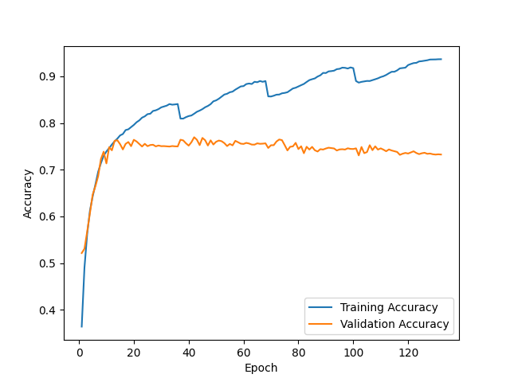
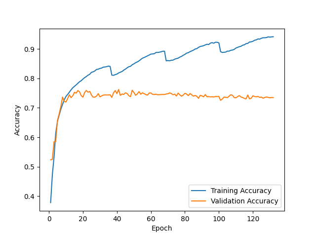
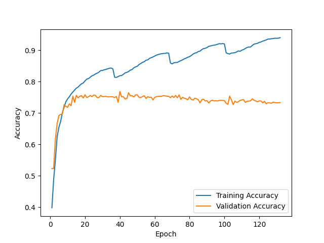
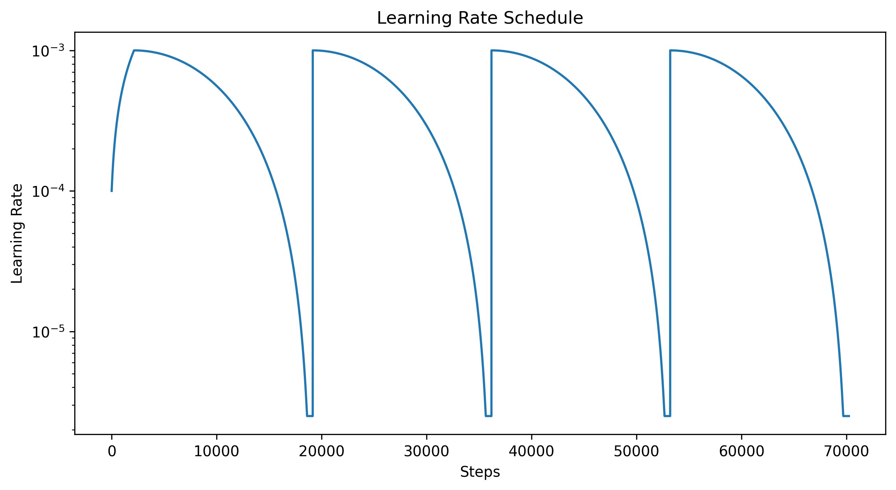

F1 score for random initialization #1 = 0.740

Prediction matrix for initialization #1

|   | N   | O   | A   |
|---|-----|-----|-----|
| N | 466 | 37  | 1   |
| O | 80  | 163 | 12  |
| A | 1   | 23  | 35  |

---

F1 score for random initialization #2 = 0.777

Prediction matrix for initialization #2

|   | N   | O   | A   |
|---|-----|-----|-----|
| N | 468 | 35  | 1   |
| O | 85  | 161 | 9   |
| A | 3   | 14  | 42  |

---

F1 score for random initialization #3 = 0.750

Prediction matrix for initialization #3

|   | N   | O   | A   |
|---|-----|-----|-----|
| N | 457 | 46  | 1   |
| O | 80  | 167 | 8   |
| A | 2   | 21  | 36  |

---

F1 score for ensemble of 3 NNs + logreg on 9 values = 0.761

Prediction matrix for ensemble

|   | N   | O   | A   |
|---|-----|-----|-----|
| N | 458 | 45  | 1   |
| O | 72  | 174 | 9   |
| A | 0   | 22  | 37  |

---

