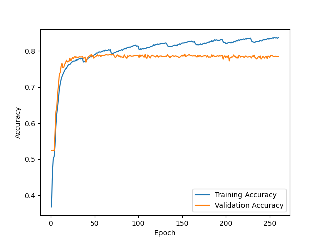
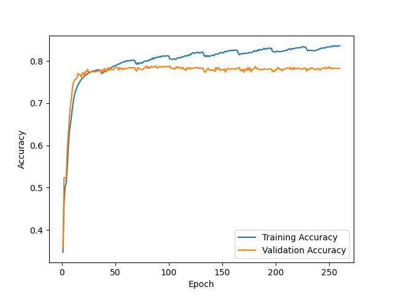
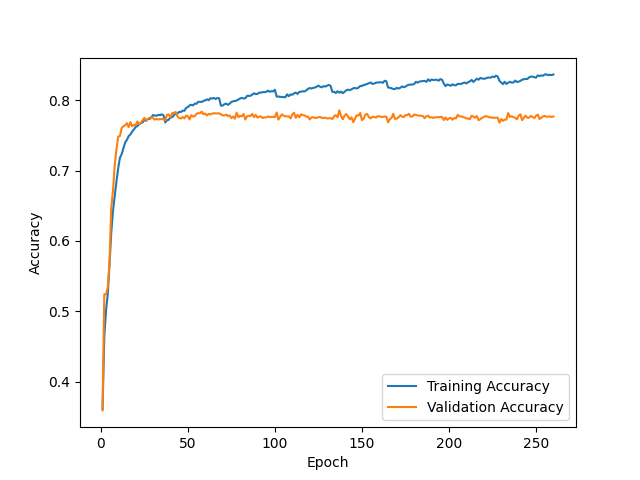
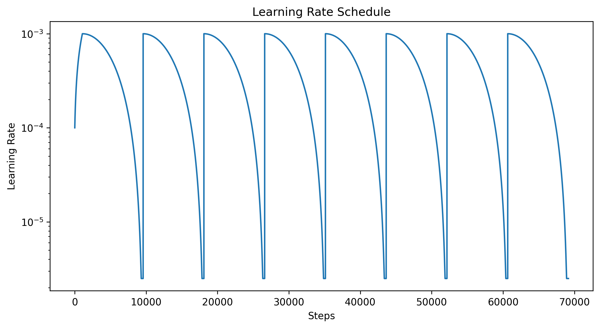

F1 score for random initialization #1 = 0.797

Prediction matrix for initialization #1

|   | N   | O   | A   |
|---|-----|-----|-----|
| N | 467 | 37  | 0   |
| O | 80  | 181 | 7   |
| A | 2   | 17  | 40  |

---

F1 score for random initialization #2 = 0.802

Prediction matrix for initialization #2

|   | N   | O   | A   |
|---|-----|-----|-----|
| N | 463 | 40  | 1   |
| O | 64  | 182 | 9   |
| A | 4   | 12  | 43  |

---

F1 score for random initialization #3 = 0.795

Prediction matrix for initialization #3

|   | N   | O   | A   |
|---|-----|-----|-----|
| N | 470 | 34  | 0   |
| O | 61  | 182 | 12  |
| A | 3   | 15  | 41  |

---

F1 score for ensemble of 3 NNs + logreg on 9 values = 0.782

Prediction matrix for ensemble

|   | N   | O   | A   |
|---|-----|-----|-----|
| N | 463 | 40  | 1   |
| O | 69  | 178 | 8   |
| A | 2   | 18  | 39  |

---

