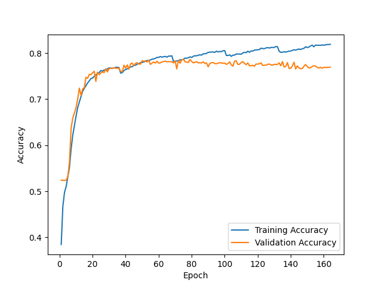
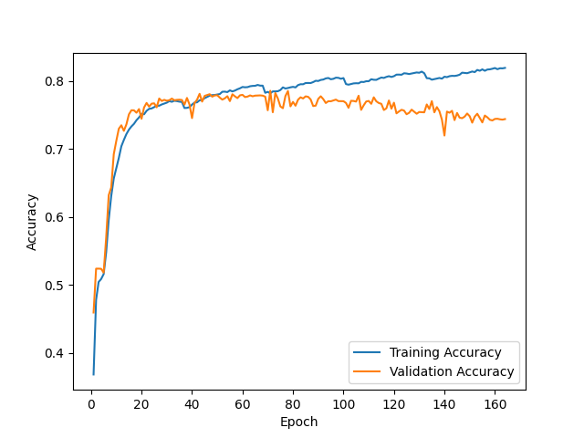
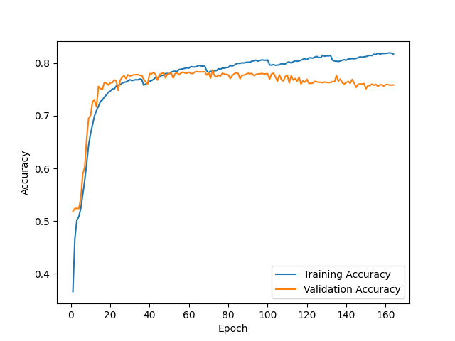
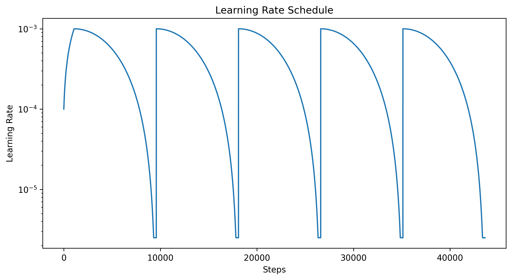

F1 score for random initialization #1 = 0.796

Prediction matrix for initialization #1

|   | N   | O   | A   |
|---|-----|-----|-----|
| N | 469 | 34  | 1   |
| O | 65  | 182 | 8   |
| A | 4   | 15  | 40  |

---

F1 score for random initialization #2 = 0.782

Prediction matrix for initialization #2

|   | N   | O   | A   |
|---|-----|-----|-----|
| N | 467 | 37  | 0   |
| O | 77  | 170 | 8   |
| A | 4   | 15  | 40  |

---

F1 score for random initialization #3 = 0.790

Prediction matrix for initialization #3

|   | N   | O   | A   |
|---|-----|-----|-----|
| N | 470 | 33  | 1   |
| O | 74  | 174 | 7   |
| A | 4   | 15  | 40  |

---

F1 score for ensemble of 3 NNs + logreg on 9 values = 0.802

Prediction matrix for ensemble

|   | N   | O   | A   |
|---|-----|-----|-----|
| N | 472 | 31  | 1   |
| O | 63  | 183 | 9   |
| A | 4   | 14  | 41  |

---

